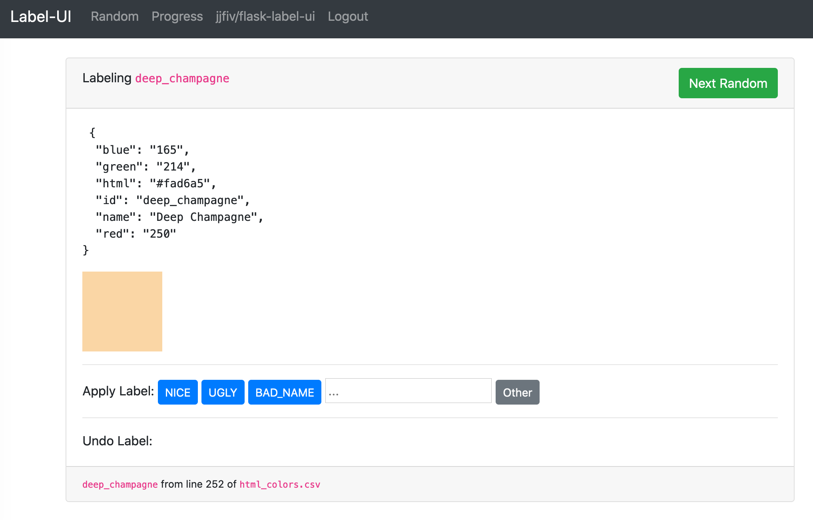

# flask-label-ui
Starter code for simple multi-class labeling with flask.



## Get the dependencies you need:

```bash
pip install -r requirements.txt # flask & sqlalchemy
```

## Running the Server:

As one line:

```bash
export FLASK_ENV=development; export FLASK_APP=server.py; flask run
```

As separate steps (in ``run.sh``)
```bash
export FLASK_ENV=development
export FLASK_APP=server.py
flask run
```

Then navigate to <a href="http://localhost:5000">localhost:5000</a> to view it locally.

## Customizing:

1. Open ``dataset.py``:
    1. Change ``DEFAULT_BUTTONS`` to whatever classes you expect to have.
    2. Change ``load_examples`` to point at your file; example loaders for CSV and JSONL are provided.
        - Feel free to downsample your data to ~3000 or so at this point (You're unlikely to label that many!).
    3. Create any fields you might want on ``Example`` -- by default they're all shoved into ``features``.
2. Change ``templates/example.j2`` to render your particular data in a user-friendly way. Each row is currently formatted as JSON.
    - You can read more about [Jinja2 templates at their documentation site](https://jinja.palletsprojects.com/en/2.11.x/).

## Running it publicly (to share with a partner)

TODO: heroku instructions